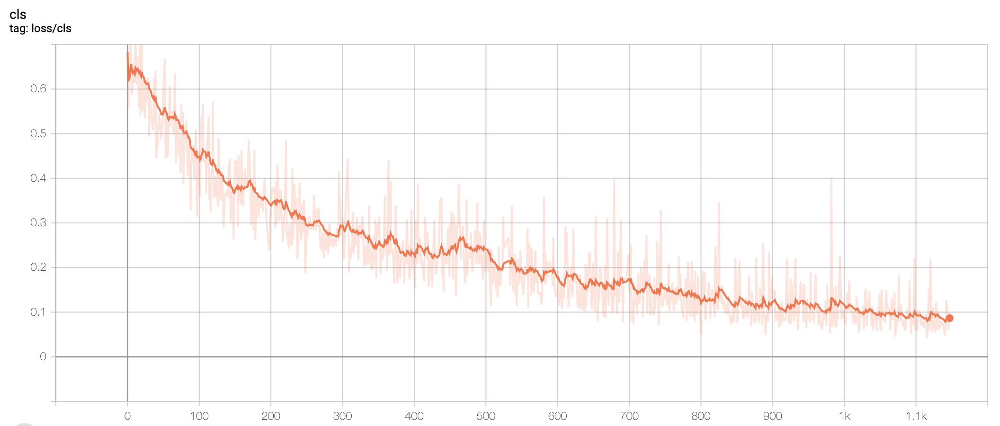
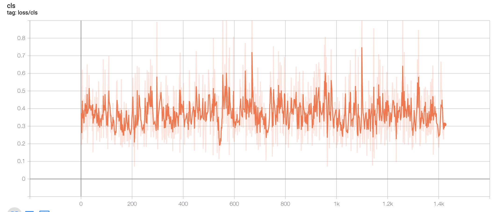

# SiamMask_master
# 项目介绍：
* 运动目标跟踪一直以来都是一项具有挑战性的 工作, 也是研究的热点方向. 现阶段, 随着硬件设施 的不断完善和人工智能技术的快速发展, 运动目标 跟踪技术越来越重要. 目标跟踪在现实生活中有很 多应用, 包括交通视频监控、运动员比赛分析、智能人机交互 、跟踪系统的设计 等. 由于在目标跟踪中存在形态变化、图像分辨率低、背景复杂等情 况, 因此研究出一个性能优良的跟踪器势在必行。

* 早期的目标跟踪算法主要是根据目标建模或者 对目标特征进行跟踪, 主要的方法有:
* 1) 基于目标模型建模的方法: 通过对目标外观模型进行建模, 然 后在之后的帧中找到目标. 例如, 区域匹配、特征点 跟踪、基于主动轮廓的跟踪算法、光流法等. 最常用 的是特征匹配法, 首先提取目标特征, 然后在后续的 帧中找到最相似的特征进行目标定位, 常用的特征 有: SIFT 特征、SURF 特征、Harris 角点等.
* 2) 基于搜索的方法: 随着研究的深入, 人们发现基 于目标模型建模的方法对整张图片进行处理, 实 时性差. 人们将预测算法加入跟踪中, 在预测值附近 进行目标搜索, 减少了搜索的范围. 常见一类的预测 算法有 Kalman滤波、粒子滤波方法. 另一种减小搜索范围的方法是内核方法: 运用最速下降法的原理, 向梯度下降方向对目标模板逐步迭代, 直到迭代到最优位置。

## 使用的模型是：

## 网络的工作流如下所示:

## 追踪效果如下所示：

# 1.Siamese网络
* Siamese network就是“连体的神经网络”，神经网络的“连体”是通过共享权值来实现的，如下图所示。共享权值意味着两边的网络权重矩阵一模一样，甚至可以是同一个网络。

* 如果左右两边不共享权值，而是两个不同的神经网络，叫伪孪生网络（pseudo-siamese network，伪孪生神经网络），对于pseudo-siamese network，两边可以是不同的神经网络（如一个是lstm，一个是cnn），也可以是相同类型的神经网络。

# 2.单样本学习
* 传统的神经网络试图学习某一个类别的图像的表达，而One-Shot Learning 试图学习不同图像(可以同一类别或者不同类别) 的区别。
给定图片A和图片B, 将A转换为一个表达(embedding vector) p, 将B转换为 一个表达(embedding vector) q
* 如果 A 和 B 属于同一个类别, 那么我们希望 p 和 q 是相似的

* 如果 A 和 B 不属于同一个类别, 那么我们希望 p 和 q 是不相似的

* 相似度的度量, 欧几里得距离：

  ## 2.1 意义
* 1. 减少训练数据
• 深度学习需要大量的数据， MNIST 为了 10 个类别的区分, 需要 60,000 张训练图像, 平均一个类别需要6000 张训练图像
• One-Shot 试图将一个类别的训练图像减少, 极端情况时减小到一张图片
* 2. 在新类别的数据出现时, 无需重新训练
• 传统的深度神经网络无法处理没有出现在训练集中的类别
• 以员工刷脸打卡为例, 使用传统深度神经网络, 每一个新员工入职, 都是一个新的 类别, 需要重新训练深度神经网络
• 如果每天都有新员工入职, 每天都要重新训练网络, 成本非常高
• One-Shot learning 可以无需重新训练即可应用于新的类别的数据

# 3.siamese在目标跟踪中的应用
* 目标追踪任务是指在一个视频中给出第一帧图像的bbox的位置，在后续的帧中追踪该物体的任务。* 
* 目标追踪不同于目标检测的是：
* 1、需要给出首帧的标定框。
* 2、只需要给出标定框，后续的搜索范围往往在上一帧图像的附近。
* 孪生网络是使用深度学习进行目标追踪的重要解决方案，主要包括：孪生网络解决目标追踪开山之作SiamFC、SiamRPN、DaSiamRPN、SiamRPN++，SiamMask

# 4.数据构建DataSet
## 4.1 初始化
* 初始化主要是参数的设置，主要包括以下内容：

## 4.2 辅助函数
* 辅助函数主要图像读取，数据查找等。

## 4.3 数据构建
* 数据构建完成了训练数据的构建，通过getItems完成，主要流程是：

# 5. 模型的构建model
## 5.1 网络结构
* SiamMask网络的实现包含两部分：分别是SiamMask_base 和SiamMask_sharp。其中SiamMask_base是基础模块，与SiamMask_base模块相比，SiamMask_sharp中增加了进行掩膜细化的refine模块。网络结构如下图所示：

* 掩膜细化的模块如下图所示：

## 5.2 custom
* custom是整个网络的载体，分别有siammask的基础网络和siammask_sharp的网络结构，其中增加了处理 mask的相关函数。
* custom.py文件中的架构如下所示： 

## 5.3 ResDowns
* ResDowns表示在resNet50特征提取后面的adjust操作，仅在ResDown中调用，如下图中红框中所示： 

## 5.4 ResDown
* ResDown是网络的特征提取层，对应图中的ResNet50和adjust，如下图所示:

## 5.5 up
* up(rpn)是边框回归和分类网络，实现过程调用DepthCorr对象，DepthCorr对象是在rpn.py中实现的，其逐通道进行相关性计算，得到相应的响应，根据该响应得到目标的分类结果检测位置。
* 该部分对应于下图中方框内部分：

## 5.6 MaskCorr
* mask分支网络，同样调用DepthCorr对象，输入为256，输出为63*63通道数:

* 网络结构如下红框中所示：

## 5.7 refine
* refine模块是掩膜细化模块，主要在siammasksharp中使用个，siammaskbase中没有使用，该模块主要用于目标的掩膜细化，如下图中红框所示： 

* 具体到U2,U3,U4,我们以U3为例展示如下：蓝色底框中即为掩膜的改进模块：

# 6. 模型训练train
* 网络的训练的实现在文件夹tools中，主要分为siammaskbase网络和siammasksharp网络的训练，在训练时我们首先训练base网络，然后对掩膜细化的refine网络进行训练，因为训练流程是类似的我们以trian_siammask.py为例给大家介绍。该文件中包含的内容如下图所示：

## 6.1 main
* main是函数主入口，主要做了一些config文件，路径以及log的操作（这些操作都是从命令行获得的，或者从命令行带有的文件里得到的参数等），接下来是根据配置信息加载数据：build_data_loader(cfg)；然后是进行模型加载，最后调用train进行模型训练,如下图所示：

## 6.2 数据集获取
* 数据集获取通过build_data_loader函数获取，流程如下所述：

## 6.3 base网络训练
* 分类的损失：

* 定位的损失：

* 分割的损失：

## 6.4 refine模块的训练
* 分类的损失：

* 定位的损失：

* 分割的损失：

# 7. 网络测试test
* 网络的测试test主要在tools中test.py中实现，该文件中包含的内容如下图所示： 

# 7.1 main
* main函数是进行网络训练的程序入口，它的执行流程是读取配置信息->设置日志输出到日志文件中->加载网络模型->加载权重文件->加载数据->进行跟踪，在进行跟踪时，还要判断是否进行目标分割，如下图所示：

